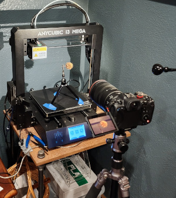
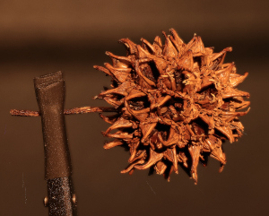

# macroPhotoShooter

## Overview
Control Canon R5 camera wirelessly via Canon's CCAPI RESTful interface, and a 3D Printer bed serially via GCode/MCode to create multiple images for macrophotograghy. The printer bed acts as a slide for the subject while the camera stays still. The program determines the Depth Of Field based on user input, then controls the bed's Y-axis movement between camera captures.

Developed with:
|Program|Version|
|------|--------|
|Python|3.8.10|
|CCAPI| 1.3.0|

## My Setup
 
The serial connection between my laptop and the **Anycubic I3 Mega** printer is USB. The printer supports Y-axis accuracy to 0.0125mm.

The Canon Camera Control API (CCAPI) interface is available via the [Canon Developer Community](https://developercommunity.usa.canon.com/s/). You must become a member of this community and they will supply a utility to activate the CCAPI on your supported Canon camera. (**Note:** Canon link is to Canon's USA community, you may have to find the community for your continent )

Code base was written in Python 3 and tested on Linux Mint 20.3

## File Info
- **macroPhotoShooter.py** - Main program. Establishes a connection to both printer and the R5. Prompts user to enter F-Stop, Lens focal length, Subject size, and Distance to Subject. Program determines the Depth of Field and computes the number of increments required to capture the entire subject. Program will loop between bed movement and image capture untill the required number of increments have been reached.
- **r5_cameraUtils.py** - Utilities controlling the R5 camera and image collection
- **gcodeUtils.py** - Utilities controlling 3D Printer and bed placement
